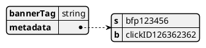

# Application

## API

| Name | Parameters                                                      | Description                                   |
|------|-----------------------------------------------------------------|-----------------------------------------------|
| emit | eventType: [EventTypes](#EventTypes) rtpxDetail: [RtpxDetail](#RtpxDetail) | Emits an event to the real time pixel object (handled by ingestion service and Kafka). |

### EventTypes 

| Name                | Description                     |
|---------------------|---------------------------------|
| RegistrationSuccess | A successful registration event |
| DepositSuccess      | A successful deposit event      |

### RtpxDetail

| Name      | Type                | Description                                                             |
|-----------|---------------------|-------------------------------------------------------------------------|
| bannerTag | string              | The player's banner tag                                                 |
| metadata  | Map<string, string> | The additional details, includes, but not limited to, s and b variables |

