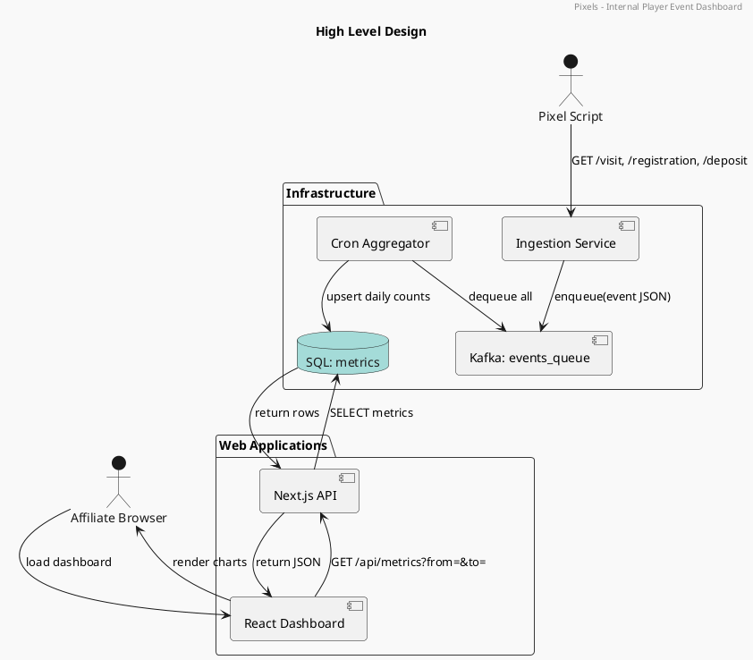
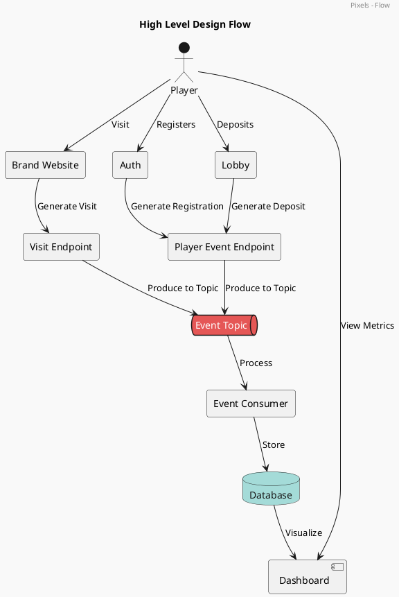
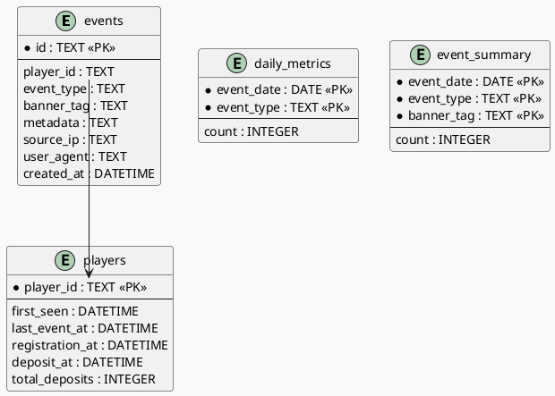

# Solution

## Business Rules

While explicit business rules may not yet be codified, the following **implicit rules** are applied:

1. **Each pixel event must include**: event type, player ID, and banner tag (as per the current pixel specification maintained internally).
2. **Duplicate events are not aggregated** more than once per day per type.
---

## Design

This solution implements an **event-driven, real-time analytics platform** for tracking player visits, registrations, and deposits using a **Kafka-based stack**.


### Key Components

- **Pixel Scripts**: Embedded in affiliate or brand websites, sending GET requests to tracking endpoints (e.g., `/visit`, `/registration`, `/deposit`) as described in the current internal pixel specification.
- **Ingestion Service**: Service that validates, normalizes, and enqueues event JSON into Kafka.
- **Kafka**: Durable, decoupled message queue for all incoming events (see `deploy/kafka/`).
- **Cron Aggregator**: Scheduled service that consumes the Kafka queue and aggregates data into structured metrics.
- **SQL Database**: Stores and serves daily aggregated metrics (see `database/schema.sql`).
- **Next.js API**: Serves metrics via a clean REST API.
- **React Dashboard**: Interactive UI to visualize metrics and trends.

---

## Use Cases

- Monitor affiliate or campaign effectiveness in real-time.
- Detect anomalies in visit → registration → deposit conversion.
- Inform marketing optimization with near-instant feedback.
- Reduce load and lag from traditional BI pipelines.

---


## Benefits

- **Real-time data visibility** within your own infrastructure.
- **Scalable and resilient** event processing using Kafka.
- **No vendor lock-in**—uses open-source, technologies.
- **Secure and fast** data handling and delivery.


## High-Level Architecture



---

## Event Flow



## Database Design

The schema supports both **raw events** and **aggregated analytics**.

### Entity Relationship Diagram




# Database Design Explanation

This database schema is designed for a **real-time player event tracking platform** using an SQL database. It supports both **raw event storage** and **aggregated analytics**, enabling fast dashboards and flexible reporting.

---

## 1. `events` Table

### Purpose
Stores **raw, unprocessed events** like visits, registrations, and deposits.

### Key Columns

| Column       | Type        | Description                                       |
|--------------|-------------|---------------------------------------------------|
| `id`         | TEXT (PK)   | Unique identifier (UUID).                         |
| `player_id`  | TEXT        | ID of the player/user.                            |
| `event_type` | TEXT        | Event type: `visit`, `registration`, `deposit`.  |
| `banner_tag` | TEXT        | Campaign or affiliate tag for attribution.        |
| `metadata`   | TEXT        | JSON string of key-value pairs (e.g., `s`, `b`).  |
| `source_ip`  | TEXT        | IP address of the client.                         |
| `user_agent` | TEXT        | Browser/device info.                              |
| `created_at` | DATETIME    | Timestamp of the event.                           |

### Notes
- Retain temporarily for replay or debugging.
- Source of truth for derived aggregates.

---

## 2. `daily_metrics` Table

### Purpose
Stores **daily counts** of each event type.

### Key Columns

| Column         | Type     | Description                            |
|----------------|----------|----------------------------------------|
| `event_date`   | DATE     | Day of the event (e.g., `2025-07-15`). |
| `event_type`   | TEXT     | Event type (`visit`, `registration`).  |
| `count`        | INTEGER  | Count of events for that day/type.     |

### Use Case
- Power time series graphs.
- Simple `GROUP BY` query support for dashboards.

---

## 3. `event_summary` Table

### Purpose
Stores **daily counts per campaign (`banner_tag`)**.

### Key Columns

| Column         | Type     | Description                             |
|----------------|----------|-----------------------------------------|
| `event_date`   | DATE     | Same as above.                          |
| `event_type`   | TEXT     | Event type.                             |
| `banner_tag`   | TEXT     | Campaign or affiliate tag.              |
| `count`        | INTEGER  | Number of events matching that combo.   |

### Use Case
- Affiliate-level performance monitoring.
- Breakdowns in the dashboard and reporting.

---

## 4. `players` Table

### Purpose
Tracks **player lifecycle events** and stats.

### Key Columns

| Column            | Type     | Description                                  |
|-------------------|----------|----------------------------------------------|
| `player_id`       | TEXT (PK)| Unique ID of the player.                     |
| `first_seen`      | DATETIME | First time the player appeared.              |
| `last_event_at`   | DATETIME | Most recent interaction timestamp.           |
| `registration_at` | DATETIME | When the player registered.                  |
| `deposit_at`      | DATETIME | First deposit time.                          |
| `total_deposits`  | INTEGER  | Count of deposits.                           |

### Use Case
- Player funnel analysis.
- Powering segmentation and targeting features.

---

## Relationships

```text
events.player_id → players.player_id
```

- Aggregates in daily_metrics and event_summary are derived from events.

- Each player’s lifecycle is updated based on their event stream.